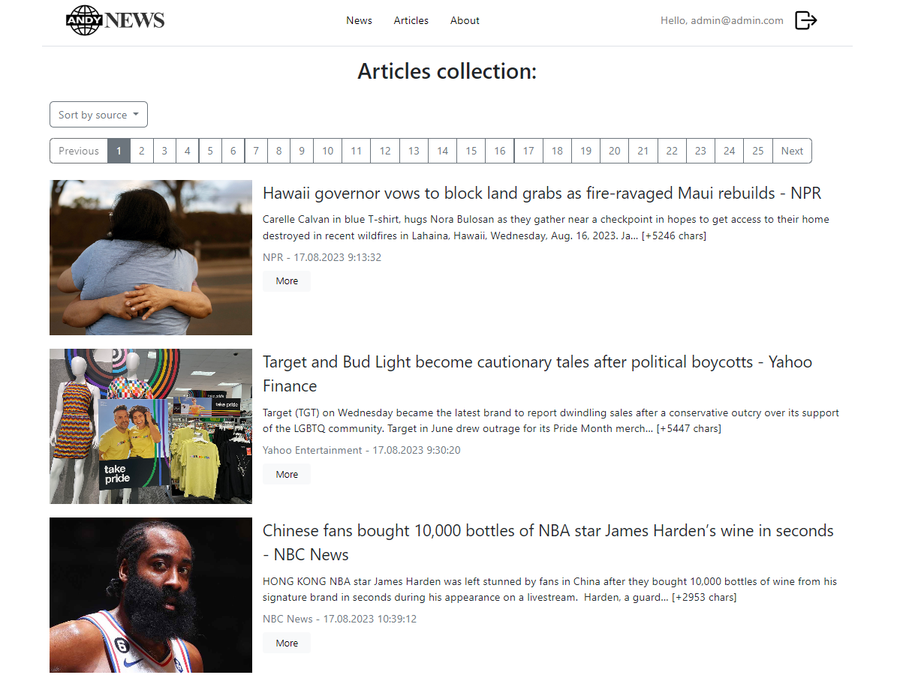
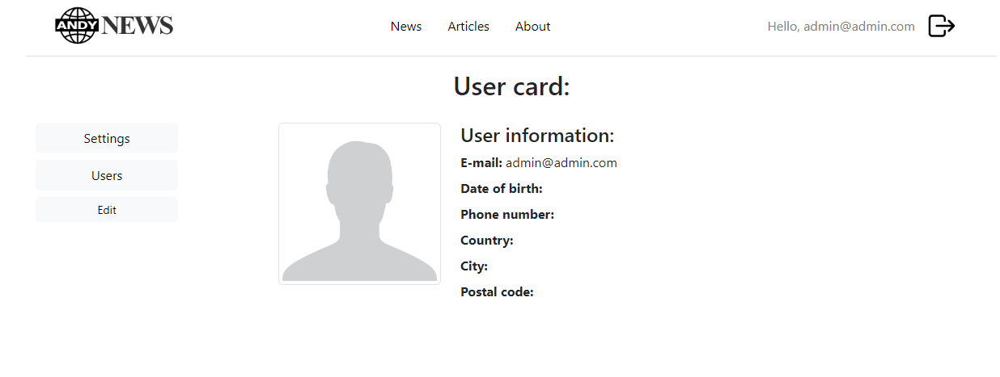
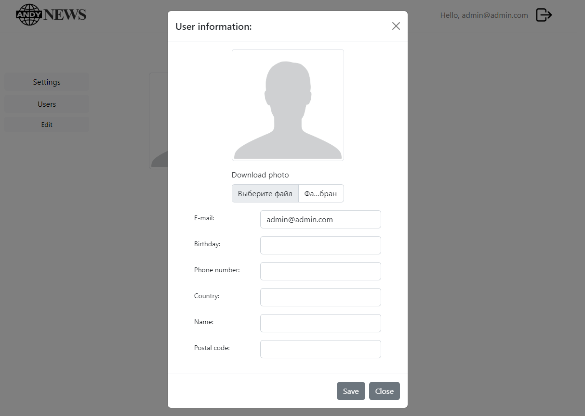
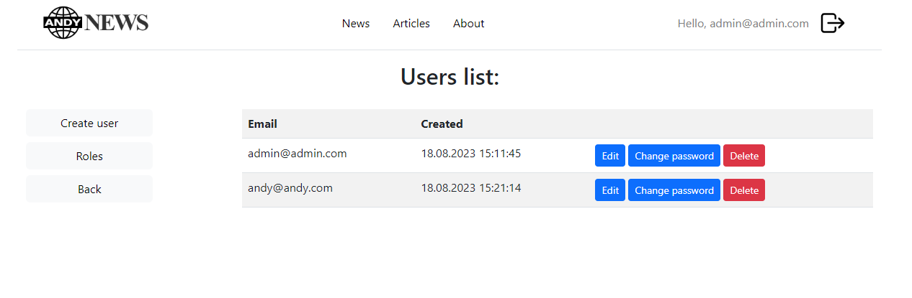
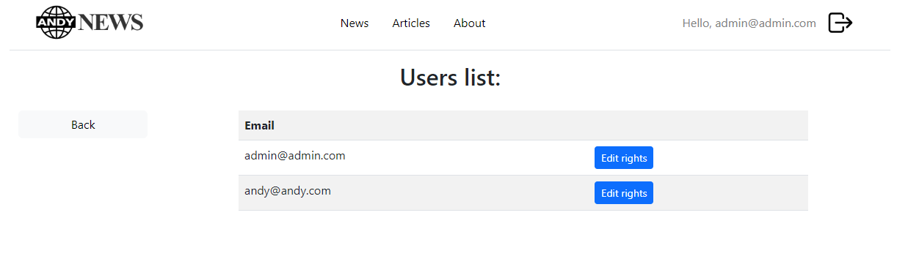
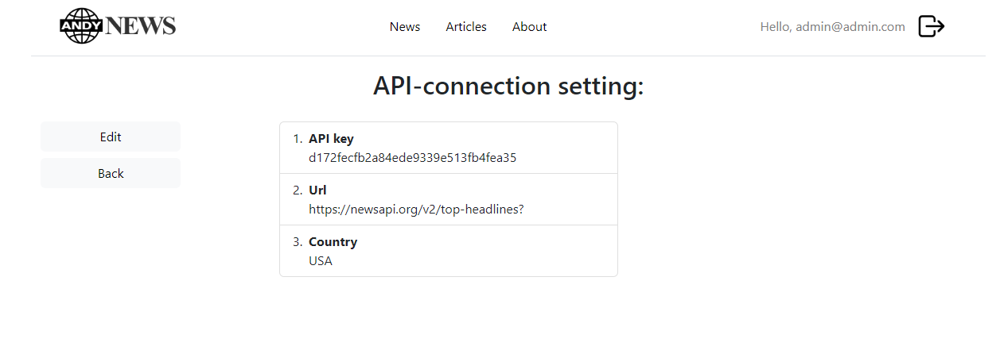
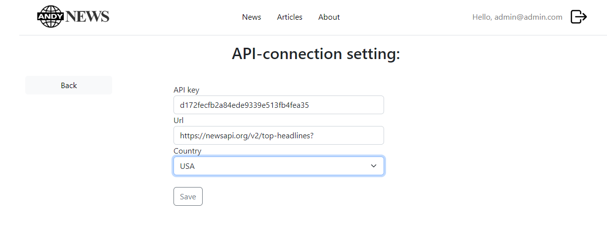

# BreakingNews
The main idea of the project is to collect international news.
The data is obtained from the newsapi.org portal. The application implements the functionality of a personal account,
with which you can change the settings for the collected news.

### The application consists of 3 parts:
* parser that receives, processes and writes news to the database;
* the application itself, with it you can view the latest news and all the contents of the database;
* base connection module(DataBases realise on PostgreSQL).

### Some screenshots:

The project is my personal initiative and serves educational purposes.
The project is alive and continues to be improved.
